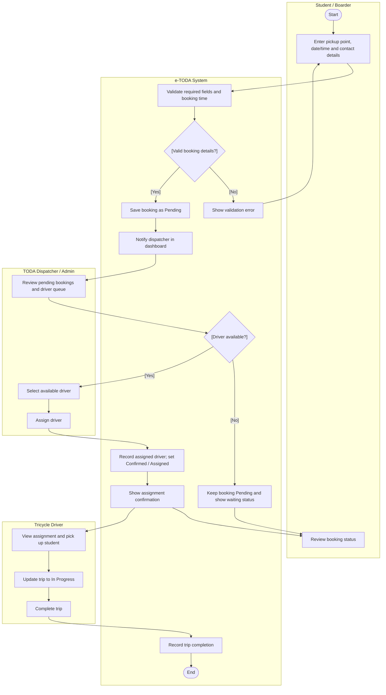

# UML Activity Diagram — Student Advance Booking and Dispatch

**Scope:** Core workflow from booking submission to trip completion.  
**Key:** Swimlanes show responsibility; diamonds are decisions; guards appear in brackets.

**Audience and risk reduced:** Developers and dispatch staff; exposes validation, no-driver-available handling and status handoffs. Status transitions must be kept consistent with `state-machine.md`.
