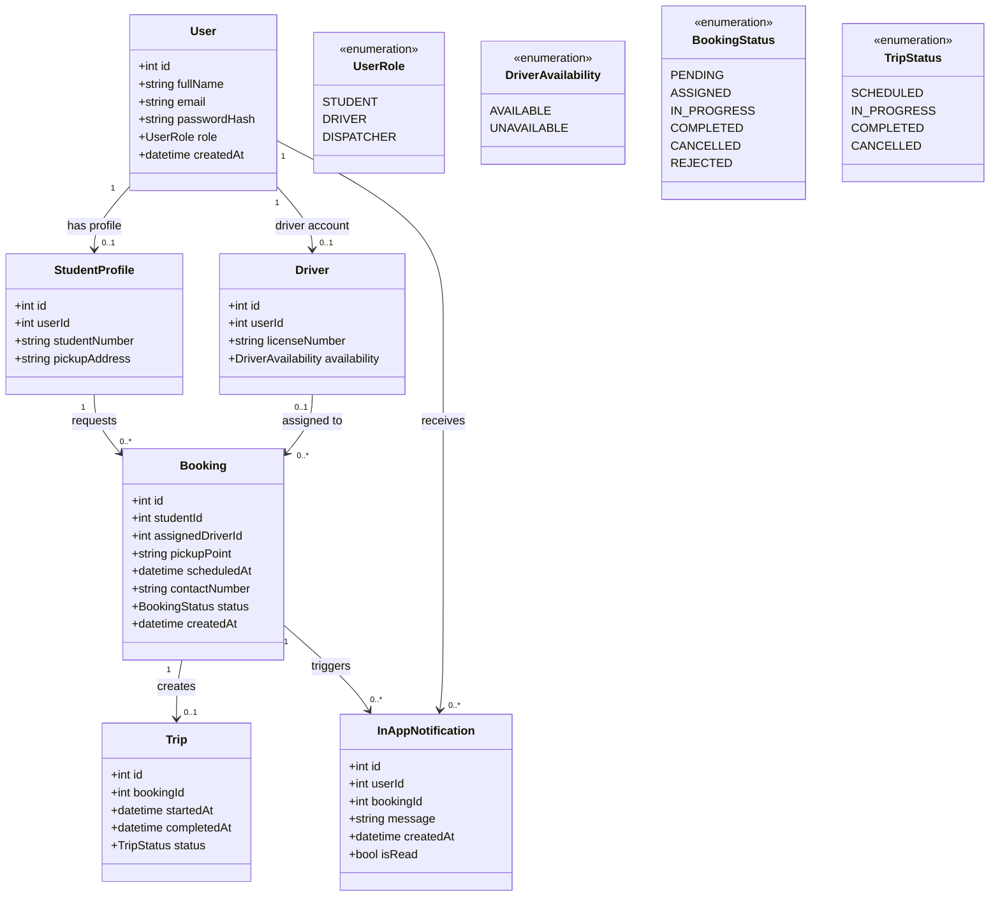

# UML Class Diagram — e-TODA Domain Model

**Scope:** Core domain classes, typed attributes, association multiplicities and status enumerations.  
**Key:** `1` and `0..*` denote multiplicity; enums constrain status values.

**Audience and risk reduced:** Developers and database designers; reduces risk of ambiguous ownership, missing relationships and inconsistent status values. Passwords are stored as hashes, never plaintext. Confirm whether student number and license number are required before final schema design.
