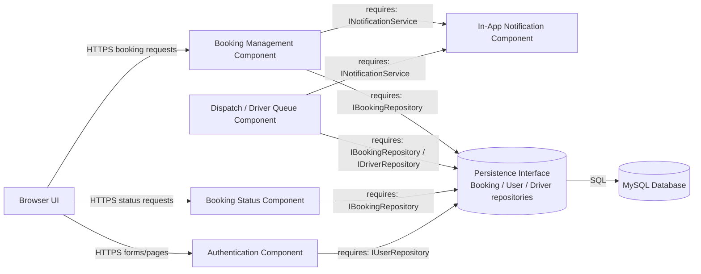

# UML Component Diagram — e-TODA API / Web Application

**Scope:** Components inside the application container and their provided/required interfaces.  
**Key:** Component boxes identify responsibilities; interface labels name contracts between components.

**Interfaces:** Booking Management provides booking create/cancel operations; Dispatch provides driver assignment and availability updates; Status provides booking status queries; Authentication provides sign-in and role checks; Notification provides in-app messages. Persistence is shown as a repository boundary. There are no external services in the proposed MVP; if SMS/email is later added, place it behind an adapter interface.
