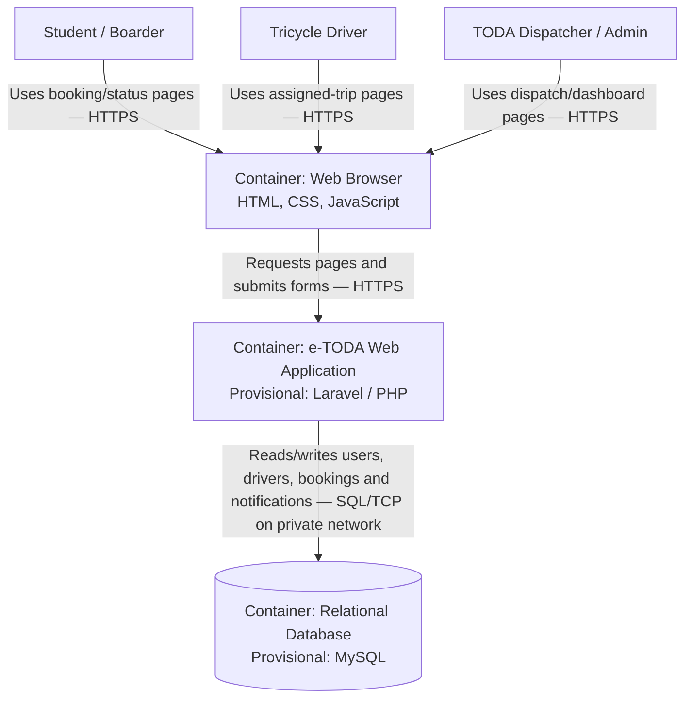

# C4 Container Diagram — e-TODA MVP

**Scope:** Deployable/runtime containers and their communication paths.  
**Key:** Browser = client; Web Application = server-side application; Database = persistent storage.

**Container decision:** The browser UI and Laravel application are shown as separate containers because the browser runs on the user's device while the application runs on a server. MySQL is a separate data container. The stack is provisional and must be confirmed by the team before implementation.
