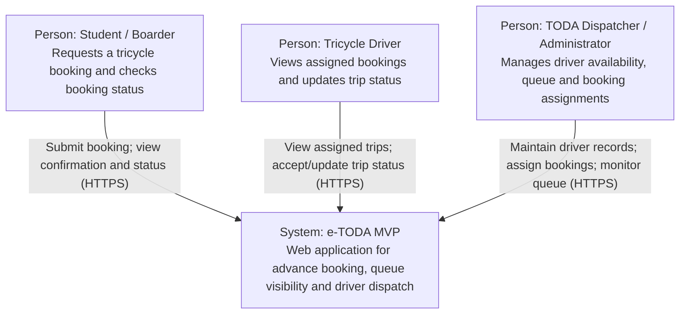

# C4 System Context — e-TODA MVP

**Scope:** People and external systems interacting with the e-TODA tricycle queuing and advance-booking system.  
**Key:** Person = user role; System = software system; arrows = purpose of interaction.

**Assumptions to verify:** The MVP is a browser-based web app; students, drivers and an authorized TODA dispatcher/admin are its roles. No payment gateway, maps API or third-party messaging service is required in the first MVP. Notifications are displayed in the application.
