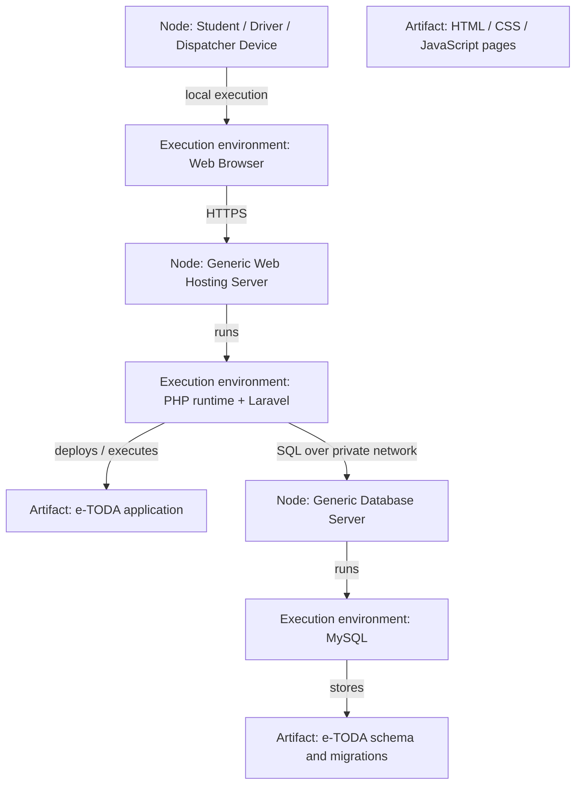

# Provisional — UML Deployment Diagram for e-TODA MVP

**Scope:** Expected deployment nodes, execution environments, artifacts and protocols.  
**Key:** Nodes are execution hosts; artifacts are deployed software; paths show protocols. No provider, secret or real address is assumed.

**Provisional note:** Hosting provider, domain, TLS configuration, backups and production network rules have not yet been selected. Use environment variables for configuration and never commit credentials or secrets.
