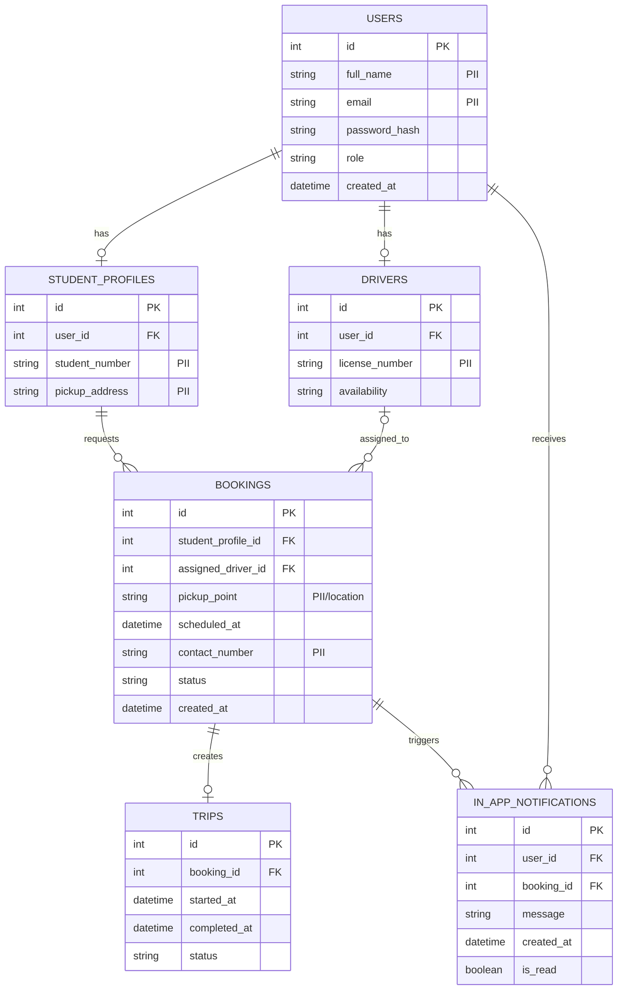

# Draft ERD — e-TODA MVP

**Scope:** Stored entities, primary/foreign keys, PII marking and cardinalities corresponding to `class.md`.  
**Key:** `PK` = primary key; `FK` = foreign key; `[PII]` = personally identifiable information.

**Design notes:** Every table has a primary key. `student_profile_id` references `STUDENT_PROFILES.id`; `assigned_driver_id` is nullable and references `DRIVERS.id`; `booking_id` in `TRIPS` should be unique to enforce at most one trip per booking. PII/location fields require access controls and should not be exposed to unauthorized users. Validate final column types and constraints against the actual MVP and repository.
