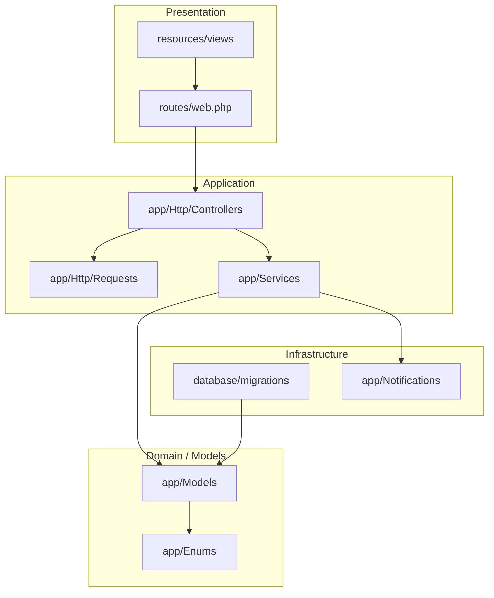

# UML Package Diagram — Provisional Laravel Project Structure

**Scope:** Proposed source folders and dependency direction for e-TODA.  
**Key:** Arrows indicate dependency/import direction.

**Layering rule:** Views and routes must not query the database directly; controllers validate requests and call application services, which use models and infrastructure adapters. This is a proposed structure to confirm against the actual repository.
