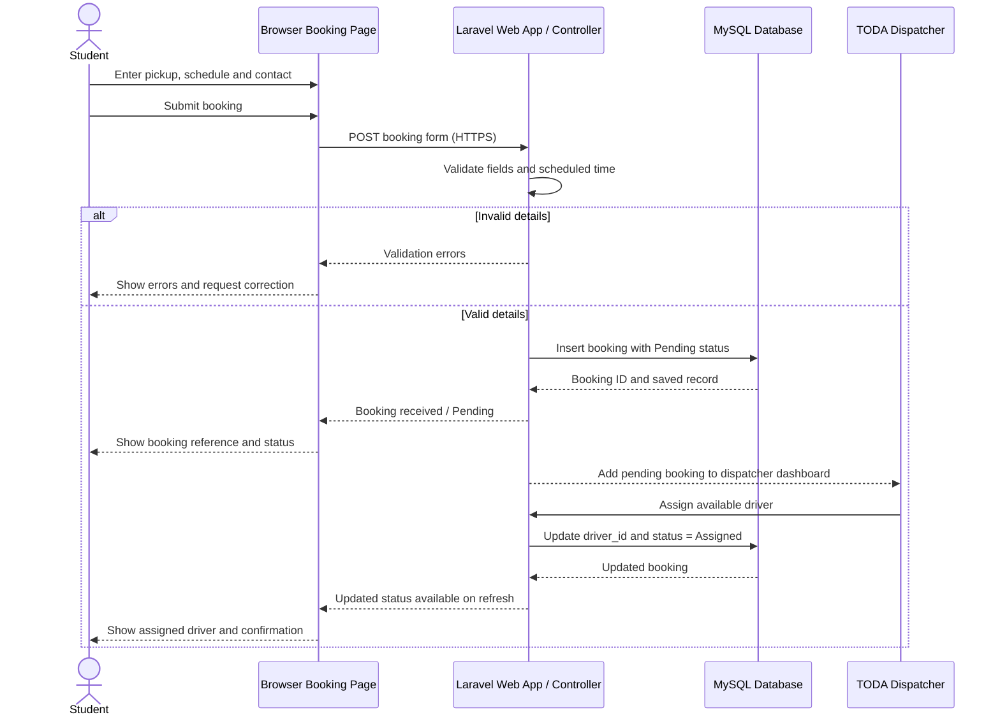

# UML Sequence Diagram — Advance Booking and Driver Assignment

**Scope:** Riskiest MVP flow: submitting a booking and receiving a driver assignment.  
**Key:** Lifelines are participants; solid arrows are synchronous requests; dashed arrows are replies; `alt` shows branches.

**Audience and risk reduced:** Backend developers and testers; reduces risks of duplicate/missing persistence, unclear validation feedback and booking status not matching the database. Dispatcher assignment is modeled as a dashboard action, not an automatic dispatch integration.
