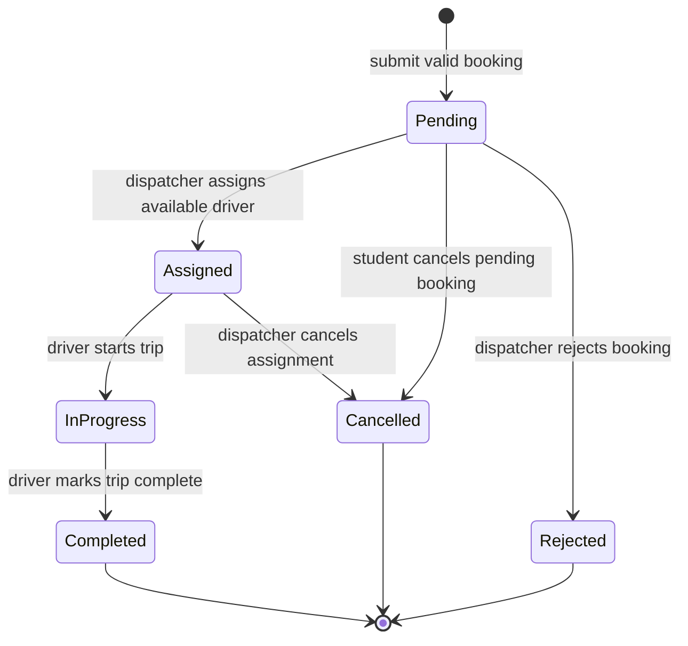

# UML State Machine — Booking Lifecycle

**Scope:** State transitions for the main status-bearing entity, `Booking`.  
**Key:** Arrows are events that trigger a transition; initial/final nodes show lifecycle boundaries.

**Audience and risk reduced:** Developers, dispatchers and QA; reduces inconsistent booking status transitions. The exact state names must match the `BookingStatus` enumeration in `class.md`. `TripStatus` records trip execution separately and should not replace booking status.
