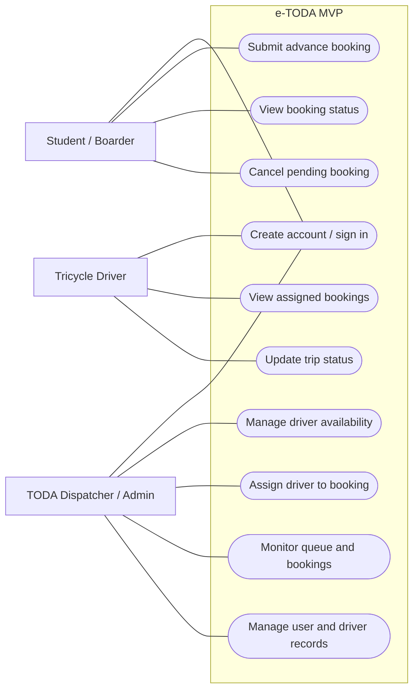

# UML Use Case Diagram — e-TODA MVP

**Scope:** Goal-level use cases for the roles identified in the system context.  
**Key:** Actors are roles; ovals are user goals inside the e-TODA system boundary.

**Audience and risk reduced:** Product owner, students and developers; reduces the risk of missing a user role or a must-have user goal. Confirm the final must-have list with the MVP feature list before coding.
